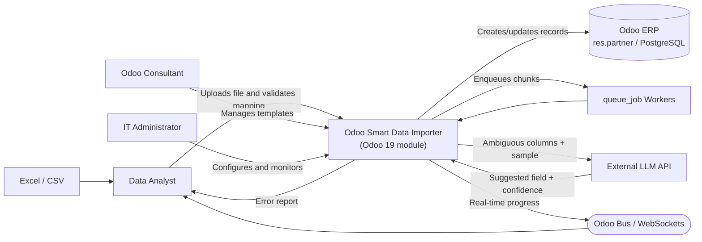
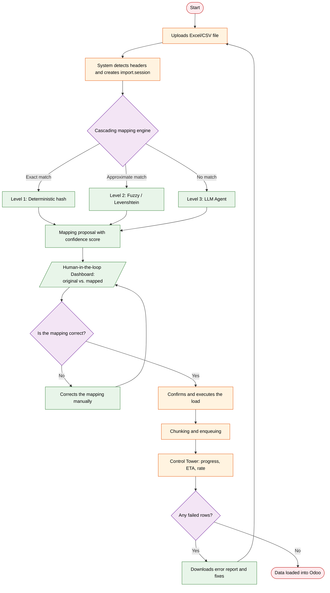
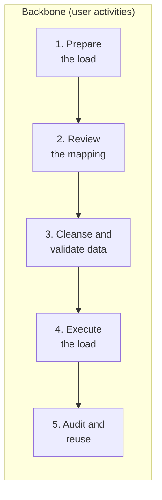
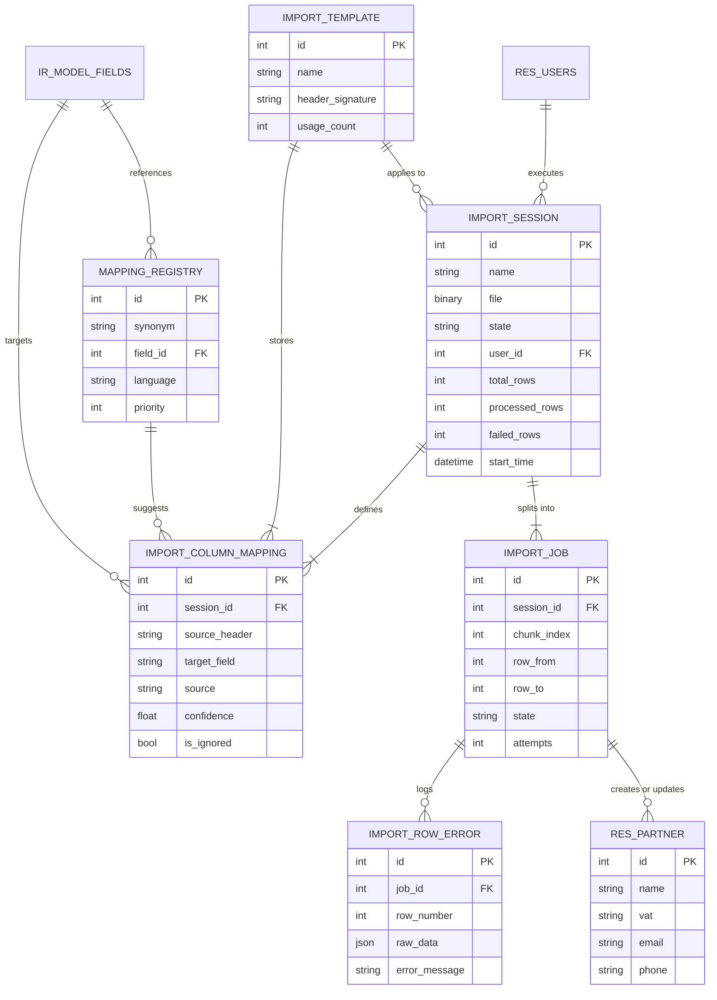
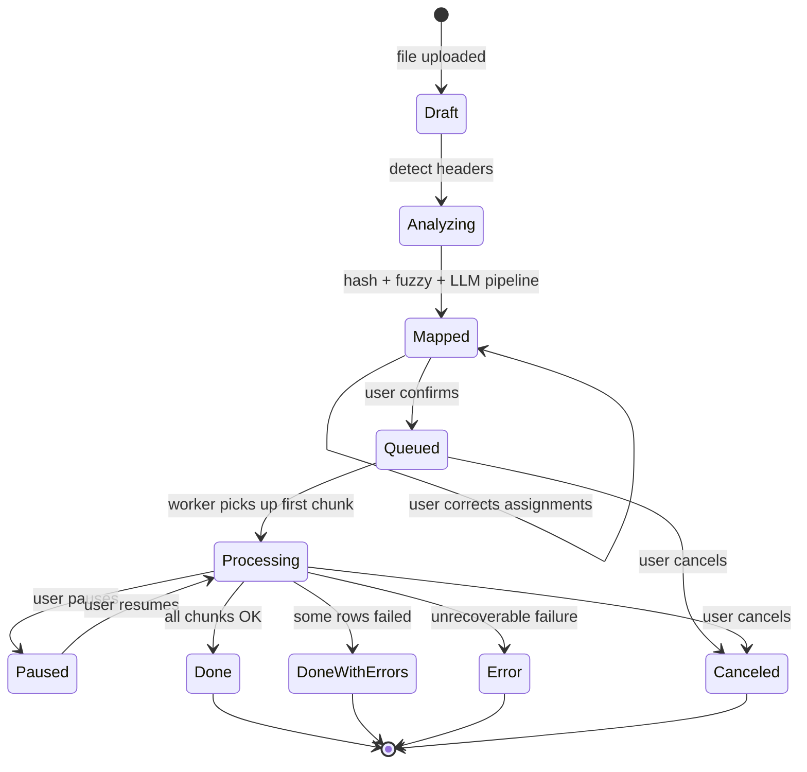
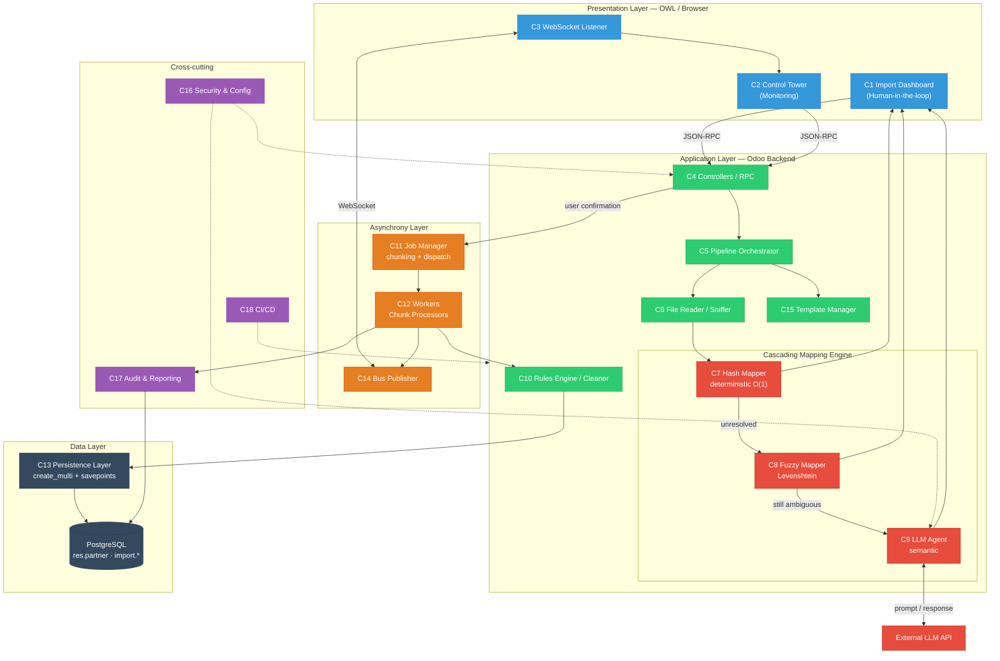

# Odoo Multi-Format Data Importer

> **integrative project 2** · deliverable Sprint 0 ·
> **Team:** Samuel Echeverri, Sara Vasquez, Adyuer Ojeda, Tomas Gañán, Victor Infante, Samuel Serpa
> **Repository:** [Repo](https://github.com/AdyuerHack/odoo-parser-0)
> **Project Board:** [Project](https://github.com/users/AdyuerHack/projects/12)
> **Deadline:** 5/08/2026

---

## index

1. [Repositories, Wiki, Agreements and Ceremonies](#1-repositories-wiki-agreements-and-ceremonies)
2. [product definition](#2-product-definition)
   - [2.1 Project Overview](#21-Project-Overview)
   - [2.2 Needs assessment](#22-Needs-assessment)
   - [2.3 User Story Mapping and Backlog](#23-User-Story-Mapping-and-Backlog)
3. [Architectural Design](#3-Architectural-Design)
4. [Interface Design (Mockups)](#4-Interface-Design-mockups)
---

---

# 1. Repositories, Wiki, Agreements and Ceremonies

## 1.1 Repositories

| Resource | URL | Description |
|---|---|---|
| Repository | <!-- TODO --> | Module Odoo 19 `Multi_format_data_importer` |
| Wiki | <!-- TODO --> | Project Docs (this wiki) |
| project Board | <!-- TODO --> | GitHub Projects: backlog, sprints and tasks |
| Evidence folder | <!-- TODO --> | Minutes, recordings and photos of ceremonies |
| Mockup (Figma) | <!-- TODO --> | Interactive Mockup  |
| Story Mapping (Miro/Canva) | <!-- TODO --> | User story map |


### Commits Convention (Conventional Commits)

```text
<type>(<scope>): <short commit title >

<short description or bullet points if more than a change>

types: feat | fix | docs | refactor | test | chore
examples: 

feat(importer): add multi-format table support

The system now accepts CSV, Excel, and JSON input formats.
This change was necessary to support legacy data sources
from various customer ERP systems.


fix(parser): handle empty CSV files

docs(readme): update installation instructions
```

### Definition of Done (DoD)

A story is considered finished when:

1. The code is in development via a pull request approved by at least one reviewer.
2. It meets all story acceptance criteria.
3. It has unit tests that pass in CI (GitHub Actions).
4. It does not introduce any linter warnings (`pylint-odoo` / `ruff`).
5. The associated documentation is up-to-date on the wiki.
6. It was demonstrated and accepted in the Sprint Review.

### Definition of Ready (DoR)

A story enters the sprint when it has a description in the format "As... I want... for...", acceptance criteria, point estimate, assigned responsible party, and identified dependencies.

## 1.2 Agreements with the Client / Product Owner

**Product Owner:** Jesús Alberto Pérez de la Hoz from Odoo

### Decision Log

| # | Agreement | Owner | Status |
|---|-----------|-------|--------|
| A1 | The MVP scope is limited to the import of **accounting** (`res.partner`). Other models are out of scope for Sprints 0–4. | Team + PO | Accepted |
| A2 | The customer provides at least **3 real anonymized files** (Excel/CSV) as guide data. | PO | Accepted |
| A3 | Follow-up meetings with the PO every week on Saturdays at 1pm utc-5 | Team + PO | Accepted |
| A4 | The system **never** writes to production without explicit human confirmation (human-in-the-loop). | Team | Accepted |
| A5 | Customer data used in testing will be anonymized; no real personal data is sent to the LLM provider. | Team | Accepted |
| A6 | The Official communication channel is Teams and the Expected response time is 24 business hours. | Team + PO | Accepted |
| A7 | Acceptance of each deliverable is recorded in writing in this wiki with date and the PO's digital signature. | PO | Accepted |
> **Evidence:** <!-- TODO: link al acta firmada / grabación de la reunión de acuerdos -->

## 1.3 Ceremony Evidence

| Ceremony | Date | Duration | Participants | Evidence |
|---|---|---|---|---|
| Client Meeting | Aug 1, 2026 | 30 min | Full Team | [Video](https://eafit-my.sharepoint.com/:v:/g/personal/ajojedab_eafit_edu_co/IQBNponrC67USovB15Cff8jwARw81q0H4VPyY9bVRxQ5U4s) |
| Sprint 0 Planning | Aug 4, 2026 | 1 hour | Full Team | [Video](https://teams.microsoft.com/l/meetingrecap?driveId=b%212Twk3-d1fE-1ZS8jtSteVWDkYkvfr6NBjncg884GSyxOLDtOnSSCSYC4IFmMj1ok&driveItemId=01VKIH7UAVNVIPL6FRQRALF2D3KTZZLLPP&sitePath=https%3A%2F%2Feafit-my.sharepoint.com%2F%3Av%3A%2Fg%2Fpersonal%2Fshecheverc_eafit_edu_co%2FIQAVbVD1-LGEQLLoe1Tzla3vAa8_CjChNcAAZHxiTiulmUg&fileUrl=https%3A%2F%2Feafit-my.sharepoint.com%2Fpersonal%2Fshecheverc_eafit_edu_co%2FDocuments%2FGrabaciones%2FPROYECTO+2+GRUPO+7+WEEKLY-20260804_170652-Meeting+Recording.mp4%3Fweb%3D1&iCalUid=040000008200E00074C5B7101A82E00807EA0804AF8B4259A21FDD0100000000000000001000000043F3498256327841BF01D5F55959E2FD&masterICalUid=040000008200E00074C5B7101A82E00800000000AF8B4259A21FDD0100000000000000001000000043F3498256327841BF01D5F55959E2FD&threadId=19%3Ameeting_ZDI3N2QyZGEtZWEzNi00MDI0LTg2NjQtYjgzN2EzZGE3Yjc0%40thread.v2&organizerId=5f203cef-be34-4252-aa5d-1ad3ab953146&tenantId=99f7b55e-9cbe-467b-8143-919782918afb&callId=4225fa48-174c-413f-a2b2-f51fb4ac43ff&threadType=meeting&meetingType=Recurring&subType=RecapSharingLink_RecapCore&recapType=RecordingAndTranscript) |
| Story Mapping Session | <!-- TODO --> | <!-- TODO --> | Team | <!-- TODO: link --> |
| Sprint 0 Review (with client) | <!-- TODO --> | <!-- TODO --> | <!-- TODO --> | <!-- TODO: link --> |
| Sprint 0 Retrospective | <!-- TODO --> | <!-- TODO --> | Team | <!-- TODO: link --> |

---

### Sprint 0 Retrospective (After sprint 0)
| team member | role | What went well | What to improve | Actions for Sprint 1 |
|---|---|---|---|---|
| Sara | Frontend Developer | Designed the full import wizard flow (6 steps: Template & Source, Data Upload, Column Mapping, Validation, Preview, Confirmation), including the product's key screens: import dashboard with metrics, column mapping with automatic suggestions and confidence scores, and a validation panel with cleanup/normalization summary and detailed errors | Mockups are still static (design only), not yet translated into real components; | Implement the mockups as functional components in code (real frontend, not just design); |
| Tomás | UX Designer | Created the empathy map to identify user needs, pain points, and goals; researched and compared similar apps to gather ideas and inspiration for our own solution | Empathy map and competitive research not yet translated into concrete wireframes or flows; no formal UX documentation produced yet | Turn empathy map insights and competitive research findings into wireframes/user flows; define missing states (loading, error, empty) alongside Sara's mockups; start UX documentation (personas or key insights) |
---
# 2. product definition

## 2.1 Project Overview

### Problem Statement

**Customer data homologation** is currently a manual task. When a company migrates to Odoo or receives third-party databases (from distributors, trade fairs, chambers of commerce, or legacy systems), each file arrives with different column headers: `NIT`, `Nit Client`, `Identification`, `Doc.`, or `RUT` all refer to the same concept, but Odoo expects the `vat` field. An analyst must open the file, interpret each column, manually rename them, and run the native importer—which fails at the first inconsistency, forcing the cycle to be repeated.

The three consecuences of the problem

| Symptom | Impact |
|---|---|
| Manual mapping time per file | from 2 to 5 h based on file size |
| Record rejection rate by the native importer | <!-- TODO: medir --> |
| Duplicates generated due to lack of standardization | <!-- TODO: medir --> |


### Proposed Software Solution

**Odoo Multi-Format Data Importer** is a native Odoo19 module that transforms a raw file (Excel/CSV) into clean Odoo records through an AI-assisted ETL pipeline.

The mapping engine works in a three-level cascade, from the reliable and low-cost rule-based approach to the high-level AI:

1. **Hash Mapping (Deterministic):** a dictionary of known synonyms with constant-time resolution. `"NIT" → vat`.
2. **Fuzzy Matching:** Levenshtein distance applied to column headers to handle spelling mistakes, accents, and capitalization differences. `"STREET" → street`.
3. **LLM Agent (Semantic Analysis):** only for the columns that remain unresolved after the previous two stages. The column name and a file of real values are sent to the agent, together with the Odoo fields, so it can infer the correct mapping and provide a justification.

None of this is a black box: the interface displays the original data alongside the mapped data, the level that made the decision, and its confidence score as a percentage and an associated color from green to red, allowing users to make corrections before persisting the data. For large volumes, processing is divided into queued chunks, and users can monitor the progress through a real-time monitoring dashboard.

### Team and roles


| Name | Role | Responsibilities |
|------|------|------------------|
| Samuel Echeverri | Scrum Master | Facilitates ceremonies, removes impediments, safeguards evidence, and serves as the primary liaison with the client |
| Victor Infante | Architect | Designs the system architecture, makes technical decisions, models the domain, and defines component boundaries |
| Samuel Serpa | QA / Testing Engineer | Defines the testing strategy, writes test cases, manages validation datasets, and oversees quality control |
| Adyuer de Jesús Ojeda | Backend Developer | Builds the ETL pipeline, Odoo models, mapping engine, queues, and persistence layer |
| Sara Vásquez | Frontend Developer | Develops OWL components for the human-in-the-loop dashboard and Control Tower |
| Tomás Gañán | UX / UI Designer | Conducts user research, creates interactive prototypes, maintains the style guide, and runs usability tests |


**Product Owner:** Jesús Alberto Pérez de la Hoz from Odoo

## Target Audience and Context

#### User Types

| User | Profile | Primary Need | Usage Frequency |
|------|---------|--------------|-----------------|
| **Data Analyst / Administrative Assistant** | Functional user, proficient in Excel, does not code. Currently performs homologation manually. | Upload a file and validate the mapping without depending on IT. | Daily / Weekly |
| **Odoo Implementation Consultant** | Technical-functional profile, migrates clients to Odoo. | Reuse mapping templates across clients and handle high-volume imports. | Per project |
| **Odoo Administrator / IT** | Technical profile. | Configure LLM credentials, permissions, queues, and monitor uploads. | Occasional |
| **Commercial Manager / Data Owner** | Does not operate the system, consumes the results. | Trust that the customer database is clean and free of duplicates. | Query / Review |
----
#### Interacting Systems

| System | Type | Role in the Solution |
|--------|------|----------------------|
| Odoo 19 (ORM + `res.partner`) | Software | Host system and data destination |
| PostgreSQL | Software | Persistence layer, batch-level `savepoints` |
| `queue_job` (OCA) | Software | Queue engine for asynchronous processing |
| Odoo Bus / WebSockets | Software | Real-time progress notifications |
| LLM Provider (API) | External Service | Semantic inference for ambiguous column headers |
| Excel / CSV Files | Data Source | Pipeline input |
| User Browser | Hardware / Software | OWL interface client |
| Application Server (Workers) | Hardware | Executes processing jobs |

#### Context diagram



### Interaction Process Description

#### Data Analyst — Main Flow



---

#### Other Users

| User | Interaction |
|---|---|
| **Odoo Consultant** | Executes the main flow and additionally saves the validated mapping as a reusable `import.template`; on the next load from the same source, the system applies the template and the mapping is immediate. |
| **IT Administrator** | Goes to *Settings → Smart Importer*: registers the LLM API key, defines chunk size and retry settings, assigns security groups, and reviews the session history. Does not upload files. |
| **Commercial Manager** | Does not operate the module. Consumes the result in Odoo's standard Contacts view and receives the load quality report. |

### Glossary of Terms

| Term | Definition |
|---|---|
| **Data Homologation** | Process of matching fields from an external source to the target system's fields. |
| **Mapping** | Explicit association between a column in the source file and a technical field in Odoo. |
| **`res.partner`** | Odoo model that stores contacts: customers, suppliers, and contact persons. |
| **`vat`** | Odoo field for the tax identification number (NIT/RUT/CIF depending on the country). |
| **ETL** | *Extract, Transform, Load*: extract data from the source, transform it, and load it into the target. |
| **Levenshtein Distance** | Minimum number of single-character edits (insertions, deletions, substitutions) required to transform one string into another. Basis for fuzzy matching. |
| **Fuzzy Matching** | Approximate text matching that tolerates typos, diacritics, and formatting variations. |
| **LLM** | *Large Language Model*. Language model used here to infer the semantic meaning of a column. |
| **Human-in-the-loop (HITL)** | Pattern where the AI proposes and a human validates before the decision takes effect. |
| **Chunk** | Block of N records into which a large file is split for parallel processing. |
| **Job / Worker** | Background task and the process that executes it, outside the HTTP thread. |
| **`queue_job`** | OCA module that provides the asynchronous job queue engine in Odoo. |
| **Odoo Bus** | Odoo's real-time notification channel, over WebSockets. |
| **OWL** | *Odoo Web Library*, the JavaScript component framework for Odoo's frontend. |
| **Savepoint** | Partial restore point within a PostgreSQL transaction; allows discarding a failed record without losing the entire batch. |
| **Payload** | Clean, normalized data structure ready to be written into Odoo. |
| **Deduplication** | Detection and unification of records representing the same real-world entity. |
| **ETA** | *Estimated Time of Arrival*: estimated remaining time to complete the load. |
| **Confidence Score** | Value from 0 to 1 indicating how confident the engine is about a proposed mapping. |
| **Import Template** | Validated and saved mapping, reusable for future loads from the same source. |
| **MVP** | *Minimum Viable Product*: the minimal version that delivers value and allows validating the hypothesis. |
---
## 2.2 Needs assessment

### Functional Requirements

#### Elicitation Process

| Technique | Date | Participants | Duration | Evidence |
|---|---|---|---|---|
| **Semi-structured interview** with the analyst who currently performs homologation | <!-- TODO --> | <!-- TODO --> | <!-- TODO --> | <!-- TODO: recording + transcript --> |
| **Direct observation** of the current manual process (*job shadowing*) | <!-- TODO --> | <!-- TODO --> | <!-- TODO --> | <!-- TODO: notes + video --> |
| **Document analysis**: 3 real client files and the native importer error log | <!-- TODO --> | <!-- TODO --> | <!-- TODO --> | <!-- TODO: anonymized files --> |
| **Story Mapping Workshop** with the PO | <!-- TODO --> | <!-- TODO --> | <!-- TODO --> | <!-- TODO: Miro board + photos --> |
| **Benchmarking** of existing solutions in the market | <!-- TODO --> | Team | <!-- TODO --> | See [competitor analysis](#competitor-analysis) |

> Interview script, transcripts, and meeting minutes: <!-- TODO: link to evidence folder -->

#### Functional Requirements Catalog

| ID | Requirement | Priority (MoSCoW) | Epic |
|---|---|---|---|
| FR-01 | The system must allow uploading `.xlsx`, `.xls`, and `.csv` files from the Odoo interface. | Must | Ingestion |
| FR-02 | The system must automatically detect the header row, delimiter, and file encoding. | Must | Ingestion |
| FR-03 | The system must preview the first N rows before processing. | Should | Ingestion |
| FR-04 | The system must map columns using a deterministic synonym dictionary. | Must | Mapping Engine |
| FR-05 | The system must apply fuzzy matching (Levenshtein) to headers that did not have an exact match. | Must | Mapping Engine |
| FR-06 | The system must query an LLM agent for ambiguous columns, sending the column name and a sample of values, restricted to Odoo fields not yet assigned. | Must | Mapping Engine |
| FR-07 | The system must display, for each column, the level that resolved the mapping and its confidence score. | Must | Transparency |
| FR-08 | The user must be able to manually correct any assignment before confirming. | Must | Human-in-the-loop |
| FR-09 | The user must be able to mark a column as "ignore". | Must | Human-in-the-loop |
| FR-10 | The system must display side-by-side the original data and the transformed data. | Must | Human-in-the-loop |
| FR-11 | The system must normalize and validate formats: email, phone, tax ID/document, country, and case formatting. | Must | Cleansing |
| FR-12 | The system must detect duplicate records within the file and against existing data in Odoo. | Must | Cleansing |
| FR-13 | The user must be able to choose the duplicate policy: skip, update, or create anyway. | Should | Cleansing |
| FR-14 | The system must split large files into chunks and process them as asynchronous jobs. | Must | Scalability |
| FR-15 | The system must publish real-time progress via Odoo Bus, without polling. | Must | Monitoring |
| FR-16 | The Control Tower must display active, queued, and completed sessions, with progress bar, records/second rate, and ETA. | Must | Monitoring |
| FR-17 | The user must be able to pause, resume, or cancel an ongoing load. | Should | Monitoring |
| FR-18 | The system must isolate errors per record: valid rows in a chunk are saved even if others fail. | Must | Robustness |
| FR-19 | The system must automatically retry jobs that fail due to transient causes (network, DB lock, LLM rate limit). | Should | Robustness |
| FR-20 | The system must generate a downloadable report of failed rows with the error reason. | Must | Robustness |
| FR-21 | The user must be able to save a validated mapping as a reusable template. | Should | Templates |
| FR-22 | The system must automatically apply an existing template when it recognizes the same header structure. | Should | Templates |
| FR-23 | The system must log traceability for each session: who, when, which file, which mapping, and which result. | Must | Audit |
| FR-24 | The administrator must be able to configure the LLM provider, API key, and chunk size. | Must | Configuration |
| FR-25 | The system must restrict access using Odoo security groups and `ir.model.access` rules. | Must | Security |
| FR-26 | The system must allow simulating the load (dry run) without writing to the database. | Could | Human-in-the-loop |

### Competitor Analysis

| Solution | Company | Approximate Cost | Description | Our Differentiator |
|---|---|---|---|---|
| **Odoo Native Importer** (`base_import`) | Odoo S.A. | Included in Odoo license | Allows uploading CSV/Excel and manually mapping columns against Odoo fields. Remembers previous mappings by exact column name. | Does not infer anything: the user assigns each column manually. Does not cleanse or normalize data, does not deduplicate, and is synchronous (blocks the interface and fails on high volumes). We automate mapping with cascading AI, cleanse data, and process via queues. |
| **Flatfile** | Flatfile, Inc. | SaaS subscription, with entry plan and volume-based pricing <!-- TODO: verify current figures at flatfile.com/pricing --> | Data onboarding platform that embeds into applications; offers assisted mapping, validation, and cleansing. | It is an external, generic product that must be integrated and paid for separately; data leaves the ERP to a third party. Our solution lives **inside** Odoo, knows the actual `res.partner` schema, and does not require leaving the ERP or paying an additional subscription. |
| **OneSchema** | OneSchema, Inc. | SaaS subscription <!-- TODO: verify current figures --> | Embeddable CSV importer with configurable validations and automatic column mapping. | Same as above: product-developer oriented, requires API integration, and is not aware of Odoo's data model. We offer native human-in-the-loop, client-specific templates, and queue monitoring in Odoo's own UI. |
| **Talend Data Preparation / Alteryx Designer** | Qlik (Talend) / Alteryx, Inc. | High-cost enterprise license <!-- TODO: verify --> | Professional ETL suites with extensive profiling, cleansing, and data transformation capabilities. | Powerful but heavy: require specialist profiles, costly licenses, and their own infrastructure, and still require building the flow to Odoo. Our proposal is one-click for a functional user, scoped to a concrete use case. |

> **Before presenting:** verify prices on official websites and cite the source with the consultation date. SaaS prices change frequently.

**Competitive Advantage Summary:** we are the only one of the four that combines *(a)* native residency within Odoo, *(b)* automatic cascading mapping deterministic → fuzzy → LLM with visible explanation, *(c)* mandatory human validation before writing, and *(d)* asynchronous processing with real-time monitoring, at no additional subscription cost.

## 2.3 User Story Mapping and Backlog

### Story Mapping

**Tablero:** <!-- TODO: link a Miro/Canva (con permiso de lectura público) -->

**Board:** <!-- TODO: link to Miro/Canva (with public read permissions) -->



| Activity | Release 1 — MVP | Release 2 | Release 3 |
|---|---|---|---|
| **1. Prepare the load** | Upload XLSX/CSV · Detect headers · Preview | Validate size and format · Multi-sheet | Direct connection to external sources |
| **2. Review the mapping** | Hash mapping · Fuzzy · LLM · View confidence and origin · Edit/ignore column | Multiple suggestions per column | Learning from previous corrections |
| **3. Cleanse and validate** | Normalize email/phone/document · Detect duplicates within file | Deduplicate against Odoo · Duplicate policy | User-customizable cleansing rules |
| **4. Execute the load** | Chunking + queues · Real-time progress · Error isolation · Failure report | Pause/resume/cancel · Automatic retries | Full session rollback |
| **5. Audit and reuse** | Session history | Save and apply templates | Data quality metrics and reports |

### Product Backlog

**Link to backlog in the management tool:** <!-- TODO: link to GitHub Projects -->

**Estimation scale:** story points, Fibonacci sequence (1, 2, 3, 5, 8, 13).


| ID | Epic | User Story | Priority | Estimate |
|---|---|---|---|---|
| US-01 | E1. Ingestion | As an analyst, I want to upload an Excel or CSV file from Odoo to start an import without leaving the ERP. | Must | 3 |
| US-02 | E1. Ingestion | As an analyst, I want the system to automatically detect headers, delimiter, and encoding so I don't have to configure them manually. | Must | 5 |
| US-03 | E1. Ingestion | As an analyst, I want to preview the first rows of the file to confirm I uploaded the correct one. | Should | 2 |
| US-04 | E2. Mapping Engine | As an analyst, I want obvious columns to map automatically using a synonym dictionary to save repetitive work. | Must | 5 |
| US-05 | E2. Mapping Engine | As an analyst, I want the system to tolerate typos and diacritics in headers using approximate matching so it doesn't fail due to a typo. | Must | 5 |
| US-06 | E2. Mapping Engine | As an analyst, I want an AI agent to propose the correct field for ambiguous columns, analyzing a sample of real data. | Must | 13 |
| US-07 | E2. Mapping Engine | As an administrator, I want to configure the LLM provider and API key to control cost and privacy. | Must | 3 |
| US-08 | E3. Human-in-the-loop | As an analyst, I want to see the original data side-by-side with the mapped data to verify the transformation before accepting it. | Must | 8 |
| US-09 | E3. Human-in-the-loop | As an analyst, I want to manually correct any proposed assignment to keep control of the decision. | Must | 5 |
| US-10 | E3. Human-in-the-loop | As an analyst, I want to see the confidence level and which engine decided each mapping to know where to focus my attention. | Must | 3 |
| US-11 | E3. Human-in-the-loop | As an analyst, I want to mark columns as "ignore" to discard information I don't want to load. | Must | 2 |
| US-12 | E3. Human-in-the-loop | As an analyst, I want to run a simulation without writing to the database to test the result without risk. | Could | 5 |
| US-13 | E4. Cleansing | As an analyst, I want emails, phones, and documents to be normalized automatically to meet the company standard. | Must | 8 |
| US-14 | E4. Cleansing | As an analyst, I want the system to detect duplicates within the file to avoid creating duplicate records. | Must | 5 |
| US-15 | E4. Cleansing | As an analyst, I want the system to detect matches with existing contacts in Odoo to decide whether to update or create. | Must | 8 |
| US-16 | E4. Cleansing | As an analyst, I want to choose the duplicate policy (skip, update, create) to adapt to each case. | Should | 3 |
| US-17 | E5. Scalability | As an analyst, I want large files to be processed in the background so I can continue using Odoo while they run. | Must | 13 |
| US-18 | E5. Scalability | As a system, I want to split the file into chunks and enqueue them to parallelize processing. | Must | 8 |
| US-19 | E6. Monitoring | As an analyst, I want to see the progress of my load in real-time, without refreshing the page, to know how much time is left. | Must | 8 |
| US-20 | E6. Monitoring | As an analyst, I want to see the processing rate and estimated completion time to plan my work. | Should | 5 |
| US-21 | E6. Monitoring | As an administrator, I want to pause, resume, or cancel an ongoing load to free server resources. | Should | 8 |
| US-22 | E7. Robustness | As an analyst, I want valid rows to be saved even if others fail so I don't lose all work due to a single error. | Must | 8 |
| US-23 | E7. Robustness | As an analyst, I want to download a report of failed rows with the error reason to fix and retry them. | Must | 5 |
| US-24 | E7. Robustness | As a system, I want to automatically retry jobs that fail due to transient causes so the user doesn't have to repeat the load. | Should | 5 |
| US-25 | E8. Templates | As a consultant, I want to save a validated mapping as a template to reuse it in future loads from the same source. | Should | 5 |
| US-26 | E8. Templates | As a consultant, I want the system to recognize a file's structure and apply the appropriate template automatically. | Should | 8 |
| US-27 | E9. Audit & Security | As an administrator, I want to consult the import session history to audit who loaded what and when. | Must | 5 |
| US-28 | E9. Audit & Security | As an administrator, I want to restrict module access by security groups to protect customer data. | Must | 3 |

**Summary:** 28 user stories grouped into 9 epics.

### Sprint 1 Planning

**Sprint 1 Goal:** *"A user can upload a file, view the detected headers, and obtain a deterministic and approximate pre-mapping on `res.partner`, within Odoo."*

**Team Capacity:** <!-- TODO: 6 people × N h/week × 2 weeks --> · **Commitment:** 21 points.

| # | Story | Estimate | Assignee |
|---|---|---|---|
| US-01 | Upload Excel/CSV file from Odoo | 3 | Adyuer Ojeda |
| US-02 | Automatic detection of headers, delimiter, and encoding | 5 | Adyuer Ojeda |
| US-03 | Preview of the first rows | 2 | Sara Vásquez |
| US-04 | Deterministic mapping using synonym dictionary | 5 | Victor Infante |
| US-05 | Fuzzy matching with Levenshtein distance | 5 | Victor Infante |
| US-28 | Security groups and `ir.model.access` | 3 | Samuel Echeverri |
| | **Total** | **23** | |
---

#### US-01 — Upload Excel/CSV file from Odoo

> **As** a data analyst, **I want** to upload an `.xlsx`, `.xls`, or `.csv` file from an Odoo view, **so that** I can start an import without leaving the ERP.

**Tasks**

- [ ] Create the module skeleton `smart_data_importer` (`__manifest__.py`, `__init__.py`).
- [ ] Define the `import.session` model with fields: `file`, `filename`, `state`, `user_id`, `create_date`.
- [ ] Create the form view and the *Smart Importer* menu action.
- [ ] Validate file extension and maximum file size.
- [ ] Store the binary and register the `ir.attachment`.
- [ ] Unit tests for the model (QA support: Samuel Serpa).

**Acceptance Criteria**

- **Given** I am authenticated with import permissions, **when** I enter the *Smart Importer* menu and select an `.xlsx` file, **then** the system creates an `import.session` in `draft` state and displays the file name.
- **Given** I upload a file with an unsupported extension (e.g., `.pdf`), **when** I save, **then** the system shows a clear error message and does not create the session.
- **Given** I upload a file that exceeds the configured maximum size, **when** I save, **then** the system rejects it indicating the limit.

**Estimate:** 3 points · **Assignee:** Adyuer Ojeda

---

#### US-02 — Automatic detection of headers, delimiter, and encoding

> **As** a data analyst, **I want** the system to detect only the header row, the separator, and the encoding, **so that** I don't have to configure them manually.

**Tasks**

- [ ] Implement the file reader with `pandas` (`read_excel` / `read_csv`).
- [ ] Detect encoding with `chardet` and delimiter with `csv.Sniffer`.
- [ ] Heuristic to locate the header row (first row with majority of non-empty, unique text cells).
- [ ] Normalize column names (trim, lowercase, remove diacritics) while preserving the original.
- [ ] Persist the list of detected columns in the session.
- [ ] Tests with at least 3 real anonymized client files.

**Acceptance Criteria**

- **Given** a CSV separated by semicolon and encoded in `latin-1`, **when** I upload it, **then** the system reads it without corrupt characters and correctly lists its columns.
- **Given** an Excel file whose header is on row 3 because the first two rows are a title, **when** I process it, **then** the system identifies row 3 as the header.
- **Given** an empty file or one with no recognizable headers, **when** I process it, **then** the system reports the issue without throwing an unhandled exception.

**Estimate:** 5 points · **Assignee:** Adyuer Ojeda

---

#### US-03 — Preview of the first rows

> **As** a data analyst, **I want** to see the first rows of the uploaded file, **so that** I can confirm I uploaded the correct file before processing it.

**Tasks**

- [ ] Create the OWL preview table component.
- [ ] Expose a model method that returns the first 10 rows.
- [ ] Handle display of null values and very long cells.
- [ ] View tests.

**Acceptance Criteria**

- **Given** a correctly uploaded file, **when** I open the session, **then** I see a table with the detected headers and the first 10 rows.
- **Given** a file with fewer than 10 rows, **when** I preview it, **then** I see all available rows without error.

**Estimate:** 2 points · **Assignee:** Sara Vásquez

---

#### US-04 — Deterministic mapping using synonym dictionary

> **As** a data analyst, **I want** obvious columns to map automatically, **so that** I don't have to repeat evident assignments in every load.

**Tasks**

- [ ] Define the `mapping.registry` model (synonym → Odoo field → model).
- [ ] Load seed synonym data in Spanish and English for `res.partner`.
- [ ] Implement `HashMapper` with key normalization and O(1) resolution.
- [ ] Tag each result with `source = 'hash'` and `confidence = 1.0`.
- [ ] Unit tests with at least 20 synonyms.

**Acceptance Criteria**

- **Given** a file with a column named `NIT`, **when** I run the pre-mapping, **then** it assigns to the `vat` field with confidence 1.0 and source `hash`.
- **Given** a column `Correo electrónico`, **when** I run the pre-mapping, **then** it assigns to `email`.
- **Given** that an Odoo field has already been assigned, **when** another column tries to map to the same field, **then** the system marks the conflict instead of silently overwriting.

**Estimate:** 5 points · **Assignee:** Victor Infante

---
#### US-05 — Fuzzy matching with Levenshtein distance

> **As** a data analyst, **I want** the system to recognize headers with typos or spelling variations, **so that** a typo does not force me to map manually.

**Tasks**

- [ ] Integrate `rapidfuzz` (or `python-Levenshtein`) in the module dependencies.
- [ ] Implement `FuzzyMapper` on columns not resolved by `HashMapper`.
- [ ] Define the acceptance threshold (e.g., ratio ≥ 85) and make it configurable.
- [ ] Log `source = 'fuzzy'` and the normalized confidence score 0–1.
- [ ] Tests with a typo dataset: `direcion`, `Teléfno`, `e-mail`, `Razon Social`.

**Acceptance Criteria**

- **Given** a column `direcion`, **when** I run the pre-mapping, **then** it proposes `street` with source `fuzzy` and visible confidence score.
- **Given** a column with similarity below the threshold, **when** I run the pre-mapping, **then** it remains *unresolved* and no field is proposed.
- **Given** the administrator changes the threshold in configuration, **when** I re-run the pre-mapping, **then** the result reflects the new threshold.

**Estimate:** 5 points · **Assignee:** Victor Infante

---

#### US-28 — Security groups and access control

> **As** an Odoo administrator, **I want** to restrict who can use the module, **so that** I can protect customer personal data.

**Tasks**

- [ ] Define the groups `Smart Importer / User` and `Smart Importer / Administrator`.
- [ ] Create `security/ir.model.access.csv` for all models in the module.
- [ ] Add a record rule so that a user can only see their own sessions.
- [ ] Hide the configuration menu from non-administrator users.
- [ ] Access tests with users from each group.

**Acceptance Criteria**

- **Given** a user without any of the groups, **when** they try to open the module, **then** they do not see the menu and receive an access error if they force the URL.
- **Given** a user in the *User* group, **when** they open the session list, **then** they only see their own.
- **Given** a user in the *Administrator* group, **when** they open the list, **then** they see all sessions and access the configuration.

**Estimate:** 3 points · **Assignee:** Samuel Echeverri

---
# 3. Architectural Design

## 3.1 MVP Scope

The complete solution contemplates a universal ETL engine capable of homologating any Odoo model from any source, with continuous learning from user corrections. The MVP cuts that scope to the minimum that demonstrates the value hypothesis.

### In Scope for the MVP

| # | Capability |
|---|------------|
| 1 | A single target model: **`res.partner`** (contacts/customers). |
| 2 | Sources: `.xlsx`, `.xls`, and `.csv` files uploaded manually. |
| 3 | Complete cascading mapping engine: deterministic hash → fuzzy (Levenshtein) → LLM agent. |
| 4 | Human-in-the-loop dashboard: original vs. mapped, confidence score, decision source, manual editing, and ignore column. |
| 5 | Cleansing and normalization of email, phone, document, and country; duplicate detection within the file and against Odoo. |
| 6 | Asynchronous chunk processing with `queue_job`. |
| 7 | Control Tower with real-time progress via Odoo Bus (progress, rate, ETA). |
| 8 | Per-record error isolation with `savepoints` and downloadable failed rows report. |
| 9 | Session traceability and group-based access control. |

### Out of Scope for the MVP

| # | Excluded | Reason |
|---|----------|--------|
| 1 | Other Odoo models (products, invoices, orders). | Value is demonstrated with one model; the architecture is already prepared to extend via `mapping.registry`. |
| 2 | Direct connectors to external sources (Google Sheets, REST API, databases). | Increases integration surface without validating the core hypothesis. |
| 3 | Retraining or fine-tuning the AI model with user corrections. | Requires historical data volume that does not yet exist. |
| 4 | Full rollback of an already confirmed session. | High transactional complexity; mitigated by simulation mode. |
| 5 | Mobile app or interface outside Odoo. | The target user works within the ERP. |
| 6 | Full multi-company and multi-language support. | Spanish and English are supported in the synonym dictionary. |

## 3.2 System Dimensions and Usage Scenarios

> These figures are the design targets agreed with the client. Adjust them with the actual data they provide.

### Volumetry

| Dimension | Target Value |
|---|---|
| Records per file (typical case) | 1,000 – 20,000 |
| Records per file (maximum supported case) | 100,000 |
| Maximum file size | 50 MB |
| Columns per file | Up to 60 |
| Chunk size | 5,000 records (configurable) |
| Concurrent loads | Up to 5 simultaneous sessions |
| Concurrent users in the module | 10 – 20 |
| Total registered users | <!-- TODO: based on client data --> |

### Expected Performance

| Operation | Target |
|---|---|
| Reading and header detection (20,000-row file) | < 5 s |
| Deterministic + fuzzy pre-mapping (60 columns) | < 2 s |
| LLM query per ambiguous column | < 8 s (with timeout and retry) |
| Writing a chunk of 5,000 records | < 30 s |
| Full load of 100,000 records | < 20 min with 4 workers |
| Control Tower update latency | < 1 s from event |
| UI response when confirming the load | < 500 ms (non-blocking) |
| Requests per second on the bus channel | ~ 1 event/s per active session |

### Usage Scenarios

| Scenario | Description | Frequency |
|---|---|---|
| **Incremental load** | The analyst uploads a small file (100–2,000 records) with new clients from the week. | Weekly |
| **Initial migration** | The consultant loads the complete historical database of a new Odoo client (50,000–100,000 records). | Once per project |
| **Recurring load with template** | The same source sends a file with the same structure each month; mapping is applied automatically. | Monthly |
| **Post-failure correction** | The analyst downloads the error report, fixes the rows, and retries only those. | On demand |
## 3.3 Non-functional Requirements

| ID | Category | Requirement | Verification Metric |
|---|---|---|---|
| NFR-01 | Performance | The system must process at least 5,000 records per minute per worker. | Load test with a 100,000-row dataset. |
| NFR-02 | Performance | No UI operation should block the HTTP thread for more than 2 seconds. | Measurement in DevTools over the 5 main actions. |
| NFR-03 | Scalability | The architecture must allow horizontal scaling by adding workers without code changes. | Test with 2 and 4 workers; total time should decrease in a near-linear fashion. |
| NFR-04 | Availability | A failure of the LLM provider must not prevent the import: the system degrades to deterministic and fuzzy mapping. | Chaos test by disabling the LLM API. |
| NFR-05 | Reliability | A single invalid record must not cause a rollback of its entire chunk. | Chunk with 3 invalid rows out of 5,000: 4,997 must persist. |
| NFR-06 | Reliability | Failed jobs due to transient causes must be retried up to 3 times with backoff. | Retry log in `queue.job`. |
| NFR-07 | Security | No personally identifiable information must be sent to the LLM without anonymization/controlled sampling and configured consent. | Review of the payload sent in the audit log. |
| NFR-08 | Security | LLM credentials must be stored encrypted in `ir.config_parameter`, never in code or the repository. | Code review and repository check (secret scanning in CI). |
| NFR-09 | Security | Access must be controlled via Odoo groups and record rules; a user can only see their own sessions. | Role-based access tests. |
| NFR-10 | Audit | Every session must log user, date, file, applied mapping, and result, and must be immutable once closed. | Query history and verification of non-editability. |
| NFR-11 | Usability | An analyst without technical training must complete a guided import in less than 10 minutes. | Usability test with 3 real users; success rate ≥ 80%. |
| NFR-12 | Usability | Every automatic mapping must display its source and confidence score: the system is not a black box. | Visual inspection of the mapping screen. |
| NFR-13 | Accessibility | The interface must comply with WCAG 2.1 Level AA for contrast, keyboard navigation, and form labels. | Audit with Lighthouse / axe: no critical errors. |
| NFR-14 | Compatibility | Works on Odoo 19 (Community and Enterprise), PostgreSQL 15+, and current versions of Chrome, Firefox, and Edge. | Compatibility test matrix. |
| NFR-15 | Maintainability | Code must follow Odoo guidelines (OCA), pass `pylint-odoo`/`ruff` with no errors, and have ≥ 70% coverage in the service layer. | CI report. |
| NFR-16 | Portability | The module must install as a standard addon without modifying Odoo core. | Clean installation on a fresh database. |
| NFR-17 | Cost | LLM consumption must be limited to unresolved columns and a bounded sample of rows; cost per session must be logged. | Token counter per session in the history. |
| NFR-18 | Internationalization | UI texts must be translatable (Spanish and English) via Odoo `.po` files. | Language change in Odoo. |
| NFR-19 | Privacy | The system must comply with Law 1581 of 2012 (Colombia) on personal data protection: purpose, minimization, and traceability of processing. | Review of the documented processing policy. |

## 3.4 Domain Modeling

### Main Entities

| Entity | Description | Key Attributes |
|---|---|---|
| **`import.session`** | Represents a complete import: the uploaded file and its entire lifecycle. It is the root aggregate. | `name`, `file`, `filename`, `state` (draft/mapping/queued/processing/done/error), `user_id`, `total_rows`, `processed_rows`, `failed_rows`, `start_time`, `end_time`, `template_id` |
| **`import.column.mapping`** | Association between a file column and an Odoo field, with the trace of how it was decided. | `session_id`, `source_header`, `sample_values`, `target_field`, `source` (hash/fuzzy/llm/manual), `confidence`, `is_ignored`, `llm_reasoning` |
| **`import.job`** | Traceability of an enqueued chunk: its row range and individual status. | `session_id`, `chunk_index`, `row_from`, `row_to`, `state`, `attempts`, `queue_job_uuid`, `error_message` |
| **`import.row.error`** | Row that could not be persisted, with its reason. Feeds the downloadable report. | `job_id`, `row_number`, `raw_data`, `error_type`, `error_message` |
| **`import.template`** | Validated and saved mapping for reuse with files sharing the same structure. | `name`, `model_id`, `header_signature`, `mapping_ids`, `usage_count` |
| **`mapping.registry`** | Synonym dictionary that feeds the deterministic mapper. | `synonym`, `model_id`, `field_id`, `language`, `priority` |
| **`res.partner`** | Odoo's native target model. The system consumes it, without structurally modifying it. | `name`, `vat`, `email`, `phone`, `street`, `city`, `country_id`, … |
| **`res.users` / `res.groups`** | Actor performing the import and their permission level. | Odoo native |
| **`ir.config_parameter`** | Module configuration: LLM provider, API key, chunk size, fuzzy threshold. | `key`, `value` |

### Entity-Relationship Diagram



### Import Session Lifecycle



## 3.5 Component Description

| # | Component | Subsystem | Responsibility | Technology | Interface Exposed |
|---|---|---|---|---|---|
| C1 | **Import Dashboard (UI)** | Presentation | Human-in-the-loop screen: preview, original vs. target mapping table, confidence score, manual editing, and ignore column. | OWL 2, XML (QWeb), SCSS, JavaScript ES6 | OWL components registered in Odoo's `registry`; consumes backend RPC. |
| C2 | **Control Tower (UI)** | Presentation | Monitoring panel: active/queued/completed sessions, progress bar, records/second, ETA, and pause/resume/cancel buttons. | OWL 2, SCSS, Chart-less animated SVG | Odoo client view (`action` tag). |
| C3 | **WebSocket Listener** | Presentation | Subscribes to Odoo Bus channel and reactively updates UI state without polling. | JavaScript, Odoo `bus_service` | `subscribe(channel, callback)`. |
| C4 | **Controllers / RPC Layer** | Application | HTTP entry point: file upload, pre-mapping trigger, load confirmation. Validates permissions and size. | Python, `odoo.http`, `@route` and `@api.model` decorators | JSON-RPC endpoints. |
| C5 | **Pipeline Orchestrator** | Application (services) | Coordinates the flow: reading → header detection → mapping cascade → proposal building. Does not contain mapping logic, delegates it. | Python 3.11 | `run_premapping(session_id)`. |
| C6 | **File Reader / Sniffer** | Services | Reads XLSX/CSV, detects encoding, delimiter, and header row; returns a DataFrame. | `pandas`, `openpyxl`, `chardet`, `csv.Sniffer` | `read(file) -> DataFrame, headers`. |
| C7 | **Hash Mapper** | Services · Mapping Engine | Level 1: deterministic matching against `mapping.registry` in constant time. | Python (`dict`), normalization with `unicodedata` | `map(headers) -> {header: field, confidence}`. |
| C8 | **Fuzzy Mapper** | Services · Mapping Engine | Level 2: approximate matching via Levenshtein distance on unresolved headers, with configurable threshold. | `rapidfuzz` (or `python-Levenshtein`) | Same interface as C7 (*Strategy* pattern). |
| C9 | **LLM Agent** | Services · Mapping Engine | Level 3: sends column name + value sample + still-available fields to an LLM and obtains the inferred field with justification. Includes timeout, retry, and degradation. | Python, `requests`/provider SDK, versioned prompts | Same interface as C7; interchangeable provider (`llm_providers/`). |
| C10 | **Rules Engine / Cleaner** | Services | Vectorized normalization and validation: email, phone (E.164), document, country, capitalization; duplicate detection. | `pandas`, `re`, `email-validator`, `phonenumbers` | `clean(DataFrame, mapping) -> DataFrame, errors`. |
| C11 | **Job Manager** | Core · Asynchrony | Splits the session into chunks, creates `import.job` records, and dispatches jobs to the queue. | Python, `queue_job` (OCA) | `dispatch(session_id, chunk_size)`. |
| C12 | **Worker / Chunk Processor** | Core · Asynchrony | Executes a chunk: cleanses, transforms, and persists in batches; publishes progress; isolates errors per row. | Python, `queue_job`, Odoo ORM (`create_multi`) | Method decorated with `@job`. |
| C13 | **Persistence Layer** | Data | Batch writing to `res.partner` with PostgreSQL `savepoints` to isolate failures and duplicate policy. | Odoo ORM, PostgreSQL 15+, `SAVEPOINT` | `write_batch(records, policy)`. |
| C14 | **Bus Publisher** | Infrastructure | Publishes progress, status, and completion events to the Odoo Bus channel. | Odoo `bus.bus`, WebSockets | `_sendone(channel, type, payload)`. |
| C15 | **Template Manager** | Services | Computes header signature, saves validated mappings, and suggests the applicable template. | Python, SHA-256 hashing of the signature | `match(headers) -> template`. |
| C16 | **Security & Config** | Cross-cutting | Groups, `ir.model.access.csv`, record rules, and system parameters (API key, chunk size, threshold). | Odoo Security Framework, `ir.config_parameter` | Declarative (CSV/XML). |
| C17 | **Audit & Reporting** | Cross-cutting | Session history, token/cost counter, and generation of downloadable failed rows report. | Python, `xlsxwriter`, Odoo list views | Download action. |
| C18 | **CI/CD** | DevOps | Runs linters and tests on every Pull Request; validates that the module installs on a clean database. | GitHub Actions, `pytest`/`odoo-test`, `ruff`, `pylint-odoo` | Workflow in `.github/workflows/`. |

### Technology Summary

| Layer | Technologies |
|---|---|
| Frontend | OWL 2, XML/QWeb, SCSS, JavaScript ES6, WebSockets (Odoo Bus) |
| Backend | Python 3.11, Odoo 19 ORM, `pandas`, `rapidfuzz`, `chardet`, `phonenumbers`, `openpyxl` |
| Asynchrony | `queue_job` (OCA), Odoo workers |
| AI | LLM Provider API (interchangeable via *Strategy* pattern) |
| Data | PostgreSQL 15+, SQL, `savepoints`, indexes on `vat` and `email` |
| Quality | `pytest`, `ruff`, `pylint-odoo`, GitHub Actions |
| Management | GitHub (repo, wiki, Projects), Figma, Miro |

## 3.6 System Component Diagram



### Design Justification

| Decision | Discarded Alternative | Why |
|---|---|---|
| **Native Odoo module** instead of external application | Standalone service (FastAPI + React) consuming Odoo XML-RPC API | The target user already lives in Odoo. A native module inherits authentication, permissions, translations, and the ORM; avoids maintaining a second infrastructure and eliminates network latency on every write. Addresses NFR-11, NFR-14, and NFR-16. |
| **Three-tier architecture** (presentation / application / data) | Logic embedded in Odoo models | Separating services (`services/`) from models allows testing the mapping engine in isolation, without spinning up a database, and keeps the code readable. Addresses NFR-15. |
| **Hash → fuzzy → LLM cascade** | Send all columns directly to the LLM | 70–80 % of columns are resolved deterministically in microseconds and at zero cost. Reserving the LLM for truly ambiguous cases reduces latency, cost, and data exposure. Addresses NFR-01 and NFR-17. |
| **Strategy pattern in mappers and LLM providers** | Direct call to a specific provider | Allows switching AI providers or adding a fourth mapping level without touching the orchestrator, and degrading to deterministic levels if the LLM fails. Addresses NFR-04. |
| **Mandatory human-in-the-loop** | Fully automatic load without validation | The cost of a wrong mapping on customer data is high and hard to reverse. Showing source and confidence turns AI into an auditable assistant, not a black box. Addresses NFR-12 and agreement A4. |
| **Asynchronous processing with `queue_job`** | Synchronous processing in the HTTP request | A load of 100,000 records exceeds any reasonable HTTP timeout and blocks an Odoo worker. Queues return control to the user immediately and allow scaling by adding workers. Addresses NFR-01, NFR-02, and NFR-03. |
| **Chunking of 5,000 records** | Single monolithic job | Limits memory usage per worker, enables parallelization, makes progress measurable, and bounds the impact of a failure. Addresses NFR-03 and NFR-05. |
| **Odoo Bus / WebSockets** | AJAX polling every 5 seconds | With 20 users and 5 active sessions, polling generates constant useless load and gives a laggy feel. The bus pushes the event when it occurs. Addresses NFR-02 and < 1 s latency. |
| **PostgreSQL `savepoints` per record** | Single transaction per chunk | Without savepoints, a single invalid row invalidates 5,000 valid records. With them, the error is isolated and reported. Addresses NFR-05. |
| **Vectorized `pandas` for cleansing** | `for` loop over rows in pure Python | Vectorized operations are orders of magnitude faster over tens of thousands of rows. Addresses NFR-01. |
| **Batch writing with `create_multi`** | `create()` record by record | Drastically reduces the number of round-trips to the ORM and database. Addresses NFR-01. |
| **Credentials in encrypted `ir.config_parameter`** | API key in code or repository variables | Prevents secret leakage and allows rotation without redeployment. Addresses NFR-08. |

---
# 4. Interface Design (Mockups)


## 4.1 Interactive Prototype

**Tool:** Figma
**Prototype link (presentation mode):** <!-- TODO: paste public Figma link -->
**Design file link:** <!-- TODO -->

> Insert screenshots of each screen here:
> ``

### Prototype Screens

| # | Screen | Purpose | Main Elements |
|---|---|---|---|
| P1 | **Import Session List** | Module entry point. | Session table with state, date, user, total/processed/failed rows · *New Import* button · State filters |
| P2 | **File Upload** | Upload the file and start the session. | Drag & drop zone · Supported formats and size · Target model selector (`Contacts`) · Template selector (optional) · *Analyze* button |
| P3 | **Preview** | Confirm the file was read correctly. | Table with first 10 rows · Detected headers · Detected encoding and delimiter · *Back* / *Continue* buttons |
| P4 | **Human-in-the-loop Mapping** | Central product screen: validate the AI proposal. | Per column: original name, 3 sample values, proposed Odoo field (editable dropdown), source badge (Deterministic / Fuzzy / AI / Manual), confidence bar, ignore button · Side panel with summary: M mapped, N ambiguous, X ignored · Hovering over an AI badge shows model justification · *Simulate*, *Save as template*, and *Confirm & Import* buttons |
| P5 | **Load Confirmation** | Last barrier before writing. | Mapping summary · Records to create vs. update · Detected duplicates and chosen policy · Irreversible action warning · *Start Import* button |
| P6 | **Control Tower** | Monitor progress without blocking the ERP. | Card per active session with animated progress bar, %, processed/total rows, rows/second, and ETA · Chunk list with state (queued / processing / OK / error) · *Pause*, *Resume*, *Cancel* buttons · "Queued" and "Completed" sections |
| P7 | **Results and Error Report** | Close the loop and enable correction. | Summary: created, updated, skipped, failed · Failed rows table with row number, raw data, and reason · *Download XLSX Report* button · *Retry Only Failed* button |
| P8 | **Configuration (administrator)** | Parameterize the module. | LLM provider and API key · Fuzzy matching threshold · Chunk size · Retry count · Token consumption and accumulated cost |

### Style Guide

| Element | Definition |
|---|---|
| Base design system | Odoo 19 Web Design System (for visual integration with the ERP) |
| Primary color | Odoo Purple `#714B67` |
| Success / deterministic color | `#28A745` |
| Warning / fuzzy color | `#FFC107` |
| AI / semantic color | `#9B59B6` |
| Error color | `#DC3545` |
| Typography | Inter / Odoo default, 14 px base |
| Grid | 12 columns, responsive from 1280 px |
| Accessibility | Minimum contrast 4.5:1, visible focus, full keyboard navigation, ARIA labels on mapping table |

## 4.2 Prototype Testing

### Acceptance Testing Session

| Data | Value |
|---|---|
| Date | <!-- TODO --> |
| Modality | <!-- TODO: in-person / virtual --> |
| Facilitator | <!-- TODO --> |
| Participants | <!-- TODO: name and role of each evaluated user --> |
| Evidence | <!-- TODO: link to recording and notes --> |

### Initial Test Cases

| ID | Test Case | Steps | Expected Result | Actual Result | Status |
|---|---|---|---|---|---|
| TC-01 | Start a new import | Open the module → *New Import* → drag an XLSX | Session is created and advances to preview | <!-- TODO --> | <!-- OK / Observation / Fail --> |
| TC-02 | Invalid format rejection | Upload a `.pdf` file | Clear error message; session is not created | <!-- TODO --> | |
| TC-03 | Interpret the preview | Review the table of first 10 rows | User recognizes their data and confirms the file is correct | <!-- TODO --> | |
| TC-04 | Understand the source badge | Ask the user what the "AI" badge on a column means | User correctly explains that the assignment was proposed by the model and that they can change it | <!-- TODO --> | |
| TC-05 | Correct a wrong mapping | Change `City` from `street` to `city` in the dropdown | The change is reflected, the badge changes to "Manual" and confidence to 100% | <!-- TODO --> | |
| TC-06 | Ignore an irrelevant column | Mark *ignore* on the `Internal Notes` column | Column is crossed out and not included in the field summary | <!-- TODO --> | |
| TC-07 | Locate doubtful columns | Ask the user to find low-confidence columns | User locates them in less than 30 seconds using the summary panel | <!-- TODO --> | |
| TC-08 | Confirm the load | Click *Confirm & Import* and read the confirmation screen | User understands how many records are being created, updated, and that the action is irreversible | <!-- TODO --> | |
| TC-09 | Interpret the Control Tower | Observe the progress screen | User identifies the % progress, ETA, and knows they can close the tab without losing the load | <!-- TODO --> | |
| TC-10 | Cancel an ongoing load | Click *Cancel* on an active session | Confirmation appears; upon accepting, the session changes to *Canceled* | <!-- TODO --> | |
| TC-11 | Understand the error report | Review the results screen with 3 failed rows | User identifies which rows failed and why, and knows how to download the report | <!-- TODO --> | |
| TC-12 | Reuse a template | Save the mapping as a template and simulate a second load from the same source | System applies the template and the mapping appears resolved | <!-- TODO --> | |
| TC-13 | Total task time | Time the complete flow P2 → P7 | Less than 10 minutes without assistance (NFR-11) | <!-- TODO --> | |

### Findings and Adjustments

| # | Finding | Severity | Action / Screen Adjusted |
|---|---|---|---|
| 1 | <!-- TODO --> | <!-- High/Medium/Low --> | <!-- TODO --> |
| 2 | <!-- TODO --> | | |

### Design Acceptance Minutes

> **Did the user/client accept the design?** <!-- TODO: Yes / Yes with observations / No -->
>
> **Client observations:** <!-- TODO -->
>
> **Approved by:** <!-- TODO: name, position --> · **Date:** <!-- TODO -->
>
> **Evidence of approval:** <!-- TODO: link to email, signed minutes, or recording -->

---